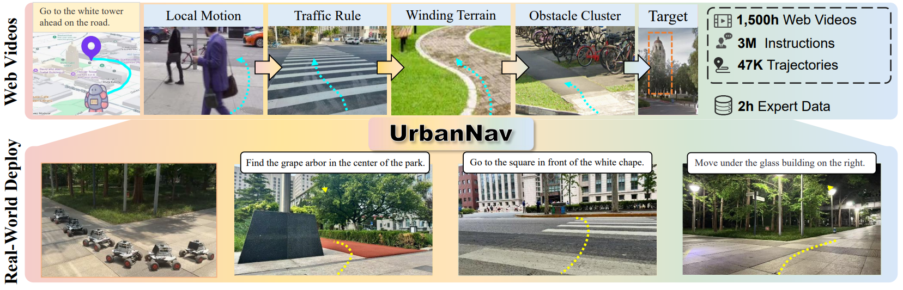
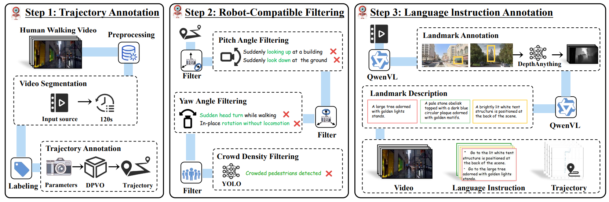

# UrbanNav: Learning Language-Guided Embodied Urban Navigation from Web-Scale Human Trajectories

### Abstract
Navigating complex urban environments using natural language instructions poses significant challenges for embodied agents, including noisy language instructions, ambiguous spatial references, diverse landmarks, and dynamic street scenes. Current visual navigation methods are typically limited to simulated or off-street environments, and often rely on precise goal formats, such as specific coordinates or images. This limits their effectiveness for autonomous agents like last-mile delivery robots navigating unfamiliar cities. To address these limitations, we introduce UrbanNav, a scalable framework that trains embodied agents to follow free-form language instructions in diverse urban settings. Leveraging web-scale city walking videos, we develop an scalable annotation pipeline that aligns human navigation trajectories with language instructions grounded in real-world landmarks. UrbanNav encompasses over 1,500 hours of navigation data and 3 million instruction-trajectory-landmark triplets, capturing a wide range of urban scenarios. Our model learns robust navigation policies to tackle complex urban scenarios, demonstrating superior spatial reasoning, robustness to noisy instructions, and generalization to unseen urban settings. Experimental results show that UrbanNav significantly outperforms existing methods, highlighting the potential of large-scale web video data to enable language-guided, real-world urban navigation for embodied agents. 

